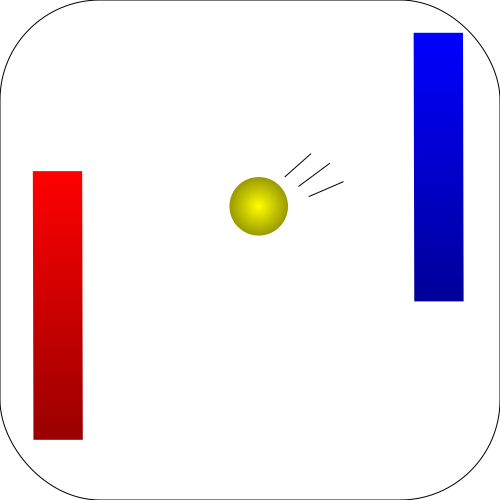

# Pong3D 🏓
<!--  -->

  

## Description

3D Pong game made with Unity.

## Manual 📖

### Goal 🎾

The goal is to let the ball pass through the line of the other player. The longer the ball bounces between players without a goal, the faster the ball is moving. The player who manages to make three goals wins.

### Keyboard Controls 🕹

- Player 1
  - [↑] Up
  - [↓] Down
- Player 2
  - [W] Up
  - [S] Down

## Gameplay (YouTube) 🎞

## Screenshots

### Pong 3D Match

### End of Game

## Asset Sources ℹ️

1. Texture - Poly Haven:\
[Metal Plate](https://polyhaven.com/a/metal_plate)
1. HDRIs - Poly Haven:\
[Dry Cracked Lake](https://polyhaven.com/a/dry_cracked_lake)
